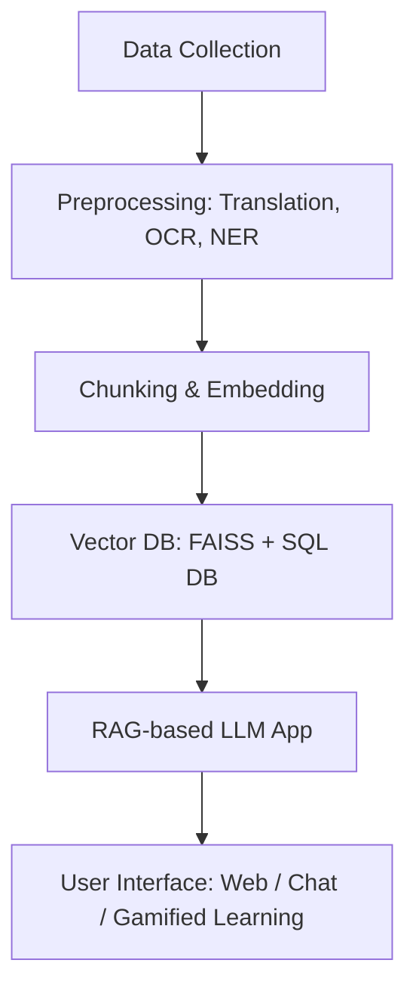

# Vichark LLM Model – Team LexCodex

**Vichark** is a multilingual, Retrieval-Augmented Generation (RAG)-based Large Language Model developed by **Team LexCodex** for the Smart India Hackathon.  
It is trained and fine-tuned on **The Constitution of India** (English, Hindi & Odia) and related legal datasets, enabling **citizens, lawyers, judges, and legal aid providers** to access simplified, accurate, and multilingual legal information.

---

## 🚀 Problem Statements Covered
Our solution integrates and addresses **five SIH problem statements**:
1. **SIH1700** – AI-based Interactive Chatbot for Department of Justice  
2. **SIH1701** – AI-Driven Research Engine for Commercial Courts  
3. **SIH1702** – Bail Reckoner Tool for Undertrial Prisoners  
4. **SIH1703** – Gamified Constitution Learning Platform (Citizen Perspective)  
5. **Multilingual Constitution Access** – English, Hindi, and Odia

---

## 🛠️ Features
- **Multilingual Support**: English, Hindi, Odia
- **Legal Q&A Chatbot** – Answers user queries in a conversational format
- **Commercial Court Research Engine** – Case law aggregation & precedent analysis
- **Bail Reckoner** – Automated bail eligibility check
- **Gamified Learning Module** – Fun & interactive way to learn the Constitution
- **Vector Database Search** – Fast and context-aware retrieval
- **Predictive Analytics** – Insights based on historical legal trends

---

## 📂 Tech Stack
**Backend**:
- Python, FastAPI / Flask
- Hugging Face Transformers
- LangChain
- PyTorch
- FAISS Vector Database
- PostgreSQL / MySQL

**Frontend**:
- React.js / Next.js
- Tailwind CSS
- Streamlit (for prototyping)
- Framer Motion (animations)

**Data Processing**:
- Pandas, NumPy
- OCR: Tesseract
- Translation: IndicTrans, Hugging Face models
- NER: spaCy, Indic NLP

---

## 📜 Workflow


---

## 👨‍💻 Team LexCodex – Roles & Responsibilities
## Backend
- Manas R. Das – Model Training
- Suryakanta Senapati – Data & Server Management
## Frontend
- Sanskritee Behera – UI/UX Design
- Subhashree Prusty – Animations
## Data Processing
- Suryakant Swain – Data Collection
- Dibyarani Behera – Data Preparation

---

## ⚙️ Installation & Setup
```bash
# Clone repository
git clone https://github.com/lexcodex/vichark-llm.git
cd vichark-llm

# Create virtual environment
python -m venv venv
source venv/bin/activate   # On Linux/Mac
venv\Scripts\activate      # On Windows

# Install dependencies
pip install -r requirements.txt
```
---

## 🚀 Running the Application
```bash
# Start backend server
uvicorn app:app --reload

# Start frontend
cd frontend
npm install
npm run dev
```

---

## 📌 Usage
- Select your preferred language (English/Hindi/Odia)
- Ask legal or constitutional queries in natural language
- Receive AI-generated, law-referenced answers
- Explore Bail Reckoner & Commercial Court Research Engine features
- Play Gamified Learning modules to learn the Constitution
---
## 📄 License
- This project is for educational and hackathon purposes under the Smart India Hackathon 2025.
- Legal accuracy is best-effort and should not replace professional legal advice.
---
## 🤝 Acknowledgements
- Department of Justice, Government of India
- Hugging Face
- Smart India Hackathon 2025 Organizers
- OpenAI & Indic NLP Resources
